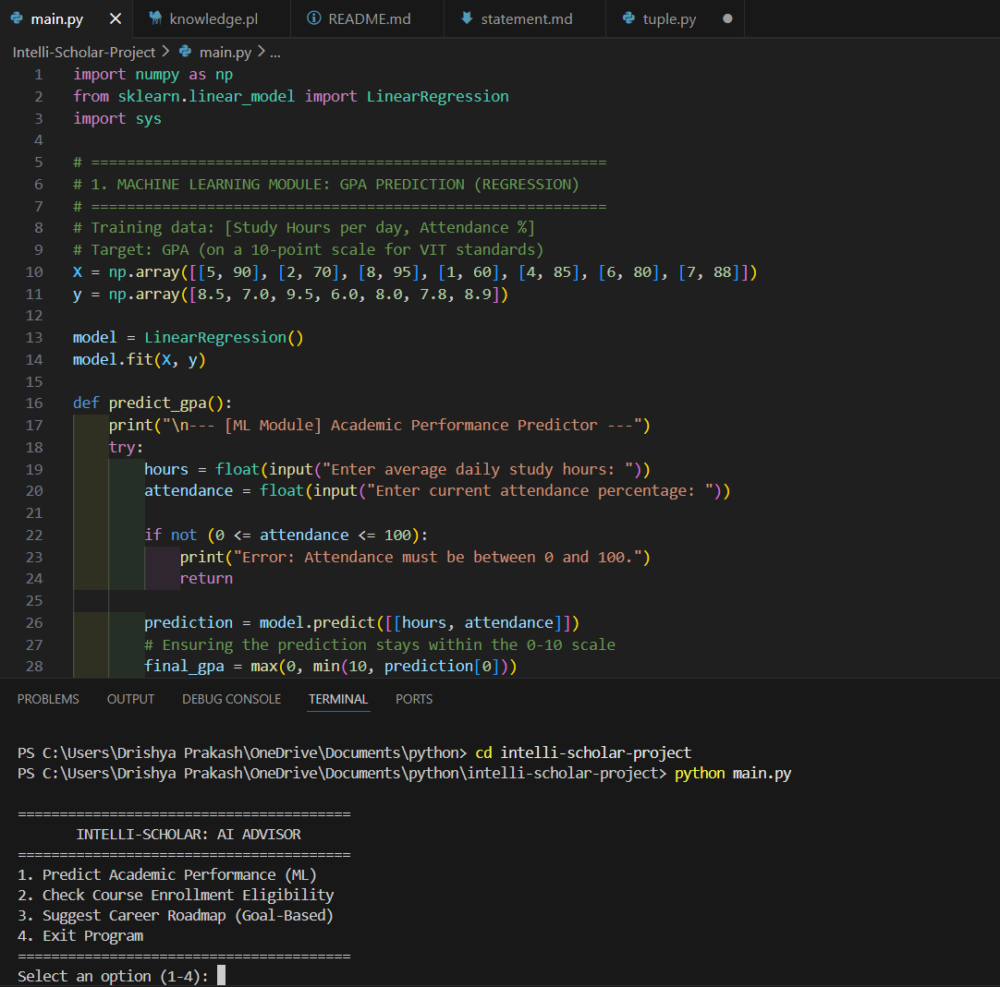
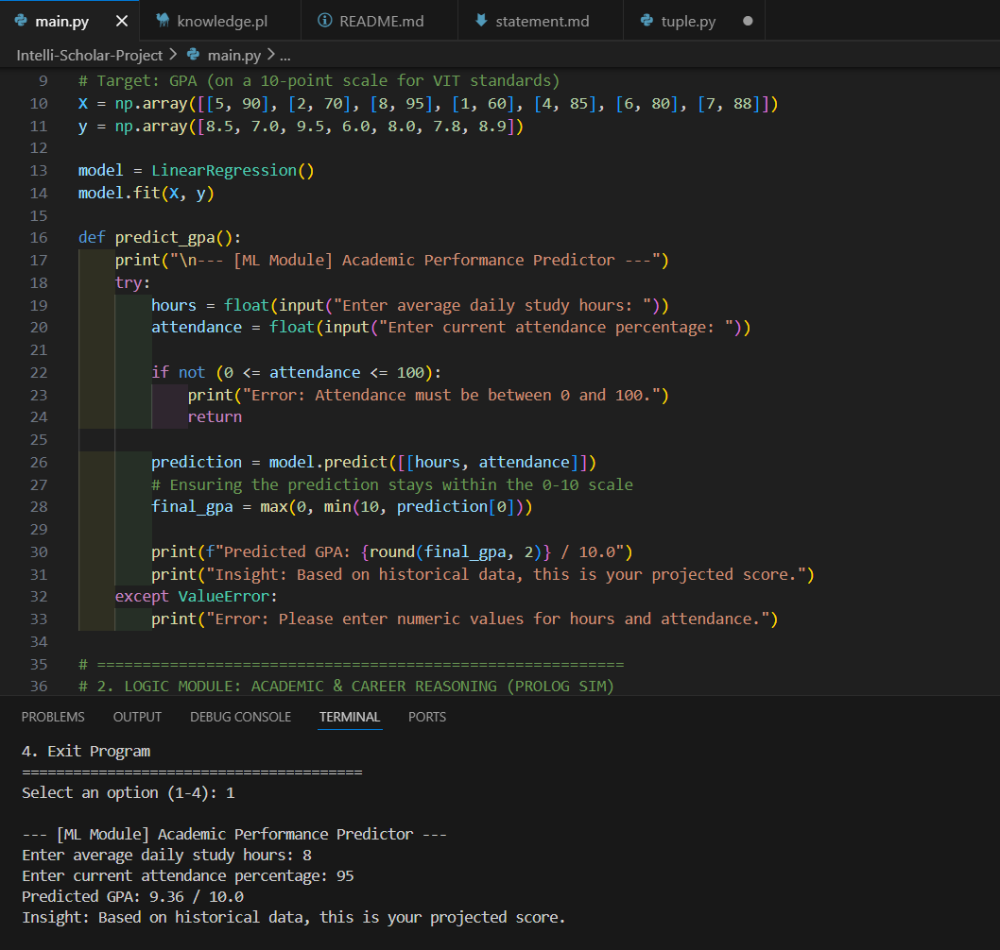
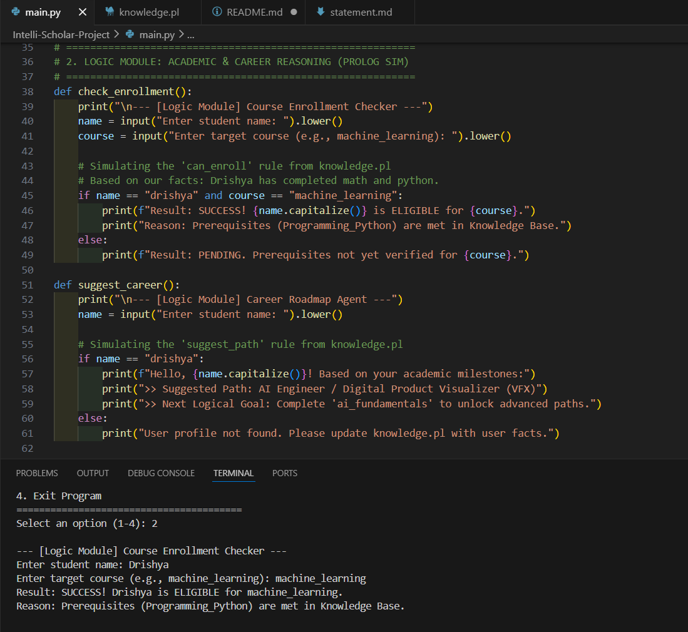
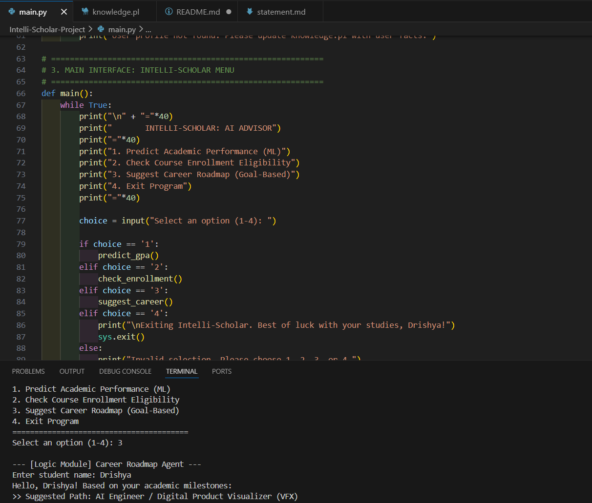

# Intelli-Scholar: Academic & Career Roadmap Agent 🎓

**Submitted by:** Drishya Prakash | 25BAI10633

📖 **Project Overview**
This is a hybrid AI and ML application developed for the **CSA2001: Fundamentals in AI and ML** course at VIT Bhopal. It acts as an Intelligent Agent that helps students predict their academic performance using **Machine Learning (Linear Regression)** and verify course eligibility using **Knowledge Representation (Prolog)**.

✨ **Features**
* **Performance Prediction:** Employs a Linear Regression model to forecast GPA based on study patterns and attendance.
* **Prerequisite Reasoning:** A Prolog-based logic engine that checks if a student meets the "First Order Predicate Logic" requirements for advanced modules.
* **Goal-Based Agent Logic:** Suggests career paths (like VFX Artistry) based on current academic progress.
* **Modular Source Code:** Logic is strictly separated into Python scripts and Prolog files for maintainability.
* **User-Friendly CLI:** A simple menu-driven interface for easy navigation and testing.

📂 **Project Structure**
The project is organized for modularity and evaluation: 
* `main.py`: Main script containing the application menu and coordination logic.
* `knowledge.pl`: The Prolog Knowledge Base containing prerequisite rules and facts.
* `statement.md`: Contains the problem statement, project scope, and target users.
* `README.md`: Project overview and setup instructions.

🛠️ **Technology Stack**
* **Language:** Python 3 & Prolog.
* **Concepts Used:** Intelligent Agents, Search Strategies, Knowledge Representation, and Supervised Learning.

🚀 **Steps to Install & Run**
1. **Clone the repository:** `git clone https://github.com/YourUsername/Intelli-Scholar-Project.git`
2. **Navigate to the directory:** `cd Intelli-Scholar-Project`
3. **Install libraries:** `pip install numpy scikit-learn`
4. **Run the application:** `python main.py`

✔️ **Instructions for Testing**
Use Option 1 for **GPA Prediction** and Option 2 for **Enrollment Check**:
* **Case 1:** Input 8 study hours and 95% attendance to see the ML prediction.
* **Case 2:** Enter name: `drishya` and course: `machine_learning` to see the logic check results.
* **Case 3:** Ener name: `drishya` to see the roadmap suggestion.

## 📸 Screenshots

### 1. Main Menu & Navigation

*The interactive CLI allows users to choose between ML-based prediction and Logic-based checking.*

### 2. GPA Prediction (ML Module)

*Linear Regression model predicting academic performance based on user input.*

### 3. Enrollment Eligibility (Prolog Logic)

*Rule-based reasoning confirming if prerequisites are met for specific courses.*

### 4. Career Roadmap Suggestion (Goal-Based Logic)

*The agent suggests a career path (AI Engineer/VFX Artist) based on academic milestones.*